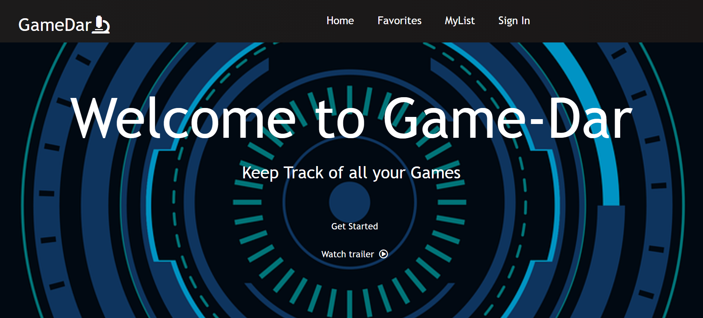
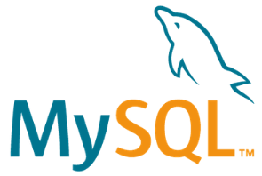

<h1 align="center" class="fas fa-microscope">Welcome to GameDar 🔬</h1>

  
  

### 🏠 [Our Project Homepage](https://github.com/ParkerM2/Project-3)

---
## ✍ Authors

**Parker Manning - https://github.com/ParkerM2**

**Thomas Althoff - https://github.com/tmalthoff**

**Emilio Conde - https://github.com/condeemilio891**

**Chambers Mansour - https://github.com/ChambersM97**

---
## User Story 📗

As a video game user, I want to be able to look up and save my favorite games to my PERSONAL list so that I am able to keep a record and share with others.

---
## 👀 Description 👀
Once a user is registered and verified, our website (for fun :o) assigns a pokemon to each individual user, and is then allowed to search a database of games to pick what they want to add to their personal game list. The effort of this project was centered around using the 

---

## Techonologies Used

---
## Installation 🔧

npm install

---
## Usage 🔱

To be able to start the application:
type `npm start`

---
## 👨‍👨‍👦‍👦 Contributing

 Checkout this link to see the team's [contributions and commits](https://github.com/ParkerM2/Project-3/graphs/contributors).

---
## Like the App?

Give a 👍🏻 if you would use this application!

<h2>Checkout our Linkedins:</h2>

 🤠 [Chambers Mansour](https://www.linkedin.com/in/chambers-mansour/)

 😀 [Parker Manning](https://www.linkedin.com/in/parkerm2/)

😁 [Matthew Althoff](https://www.linkedin.com/in/thomasalthoff/)

***
_This README was generated by [readme-md-generator](https://github.com/kefranabg/readme-md-generator)_